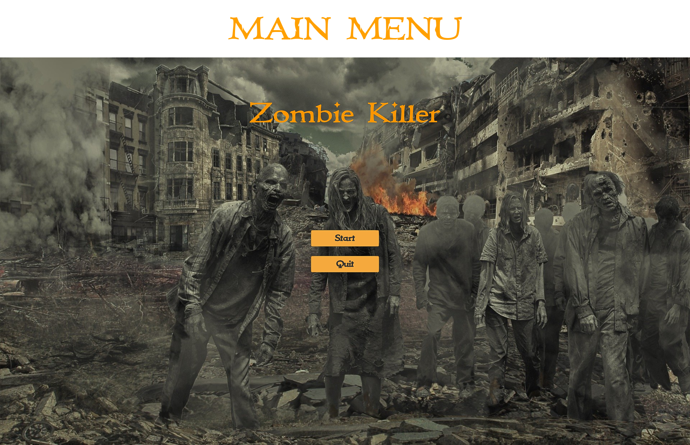

## Important links
* [Release](https://github.com/Macix97/zombie-killer/releases)
* [License](https://github.com/Macix97/zombie-killer/blob/main/LICENSE.txt)
* [Documentation](https://github.com/Macix97/zombie-killer/tree/main/Docs/ZombieKillerV1.0.pdf)

## Abstract

Zombie Killer is simple shooter with isometric camera view. The action takes place in small closed area overcrowded with enemies. The enemies multiply very quickly over time.

## Features

The list below presents most important properties:
* Simple main menu and pause.
* Character controller using mouse to rotate the character and WASD keys to move.
* One type of enemy - Zombie.
* Unlimited player ammo.
* One small playable level.

## Game visualization

### The pictures below show the most important aspects of the program:

## Used technologies

The list of used solutions:
* Unity 2021.3.3f1 - Efficient and expanded game engine.
* Visual Studio Code 1.71.2 - Primary, lightweight IDE.
* Blender 3.2.2 - 3D computer graphics software used for creating visual effects.
* GIMP 2.10 - Open source image editor.
* Mixamo 2022 - Web service that provides animations with characters.

## Credits

The author of the project have using some arts shared by CC0 or CC BY license. Without this support, the game would not be possible. A complete list of the used materials and their creators can be found in the credits text file. Moreover, many free resources from the unity asset store were included.